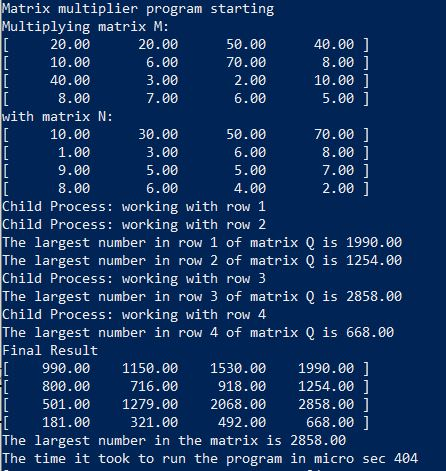
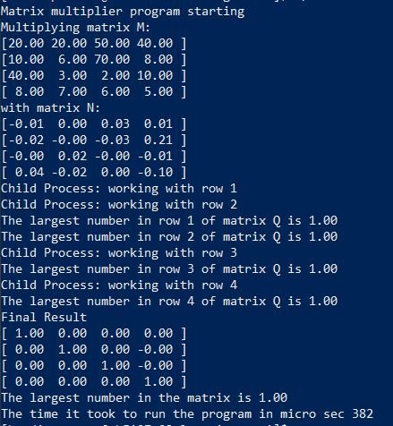

# Matrix Multiplier Program

by Bardia Parmoun

Released on: 16/02/2021

## DESCRIPTION
- This program is used to calculate the result of the multiplication of two matrices. 
- It uses fork() to create a new child process for every row of the matrix. 
- The result of each operation is recorded on the shared memory which is then read as a whole by the parent process. 

## RUNNING THE PROGRAM
- This programs needs to be tested in a Linux environment. 
- Requires a gcc version of 9.3.1 or higher
1. To run the program first run the makefile to compile the executable file by typing:
```shell
$ make
```
2. After that an executable with the name of MMULT has been generated which  can be run using:
```shell
$ ./MMULT
```
 
## USING THE PROGRAM
To run the program first the matrices M and N need to be initliazed in the header file. This can be achieved by openining the header file and editing it.

1. To open the header file type:
```shell
$ vi shm_shared.h
```
2. Locate the following code:
```c
#define MATRIX_SIZE 4
double M_MATRIX[4][4] = {{20,20,50,40},{10,6,70,8},{40,3,2,10},{8,7,6,5}};
double N_MATRIX[4][4] = {{10,30,50,70},{1,3,6,8},{9,5,5,7}, {8,6,4,2}};
```
3. Now the program is ready to run after this
<p align="center">

</p>
This is the mandatory testcase was provided in the assignment description and the result that is shown is the correct output.

## Testing multiplication with the identity matrix:
In this testcase the original matrix is multiplied with the identity matrix which would produce the original matrix as a the output
<p align="center">

</p>

## Testing multiplication with the inverse matrix:
In this testcase the matrix is multiplied by its inverse which should produce the identity matrix. 
<p align="center">

</p>

## CREDITS
Author: Bardia Parmoun

Copyright © 2021 Bardia Parmoun. All rights reserved
